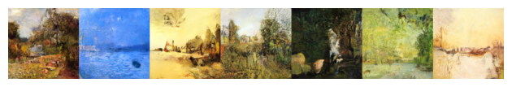
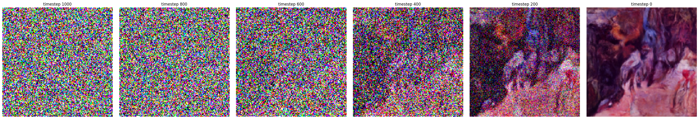
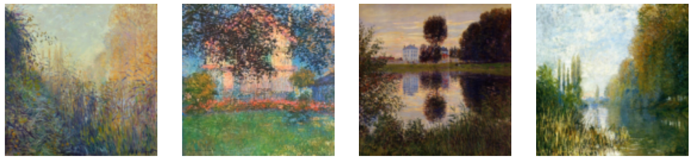

# PGM
Introduction to Probabilistic Graphical Models and Deep Generative Models Course as part of M2 MVA

## Project Overview

This project focuses on the implementation of **Denoising Diffusion Probabilistic Models (DDPM)** as described in *Ho et al.* (2020). The goal was to implement the training and sampling processes of the DDPM model, optimizing it using **Hugging Face's Diffusers** library, and apply it to a new dataset of **impressionist paintings**. 

We successfully implemented the DDPM model as outlined in *Ho et al. (2020)*, which is one of the seminal works in the field of diffusion models. This paper laid the groundwork for many advancements, including improvements in sampling efficiency, conditioning, multi-task learning, and reducing the computational costs associated with diffusion models.



The dataset used for training consists of 2287 paintings from the **WikiArt** collection, specifically focusing on impressionist artworks from renowned artists.

The implementation follows the parameters from the article, with optimizations using **Hugging Face's Diffusers** library, which significantly simplified the process of training and inference for diffusion-based models.



## Getting Started

### Data Preparation

To begin using the project, you need to prepare the data. The dataset used here focuses on impressionist paintings by the following artists:

- Claude Monet
- Pierre-Auguste Renoir
- Edgar Degas
- Camille Pissarro
- Alfred Sisley
- Paul Cezanne
- Berthe Morisot
- Mary Cassatt
- Gustave Caillebot



To download and preprocess the dataset, run the following notebook: **data/impressionism_data.ipynb**.

This notebook will automatically download the selected paintings by the above-listed artists for future training.

### Running the Project

Once the data is prepared, you can proceed with training and sampling. The main scripts for training and generating samples are already implemented. Refer to the following files to run the project:

- **diffusion_impressionism.ipynb** - for training the DDPM model and generate new samples

Make sure to adjust the training parameters as needed, based on your available hardware and specific requirements. Especially : 
- `config.image_size`
- `config.train_batch_size`


### Requirements

Make sure you have the following dependencies installed:

- Python 3.x
- PyTorch
- Hugging Face's `diffusers` library
- Other dependencies listed in `requirements.txt`

### Citation

If you use this code or model in your work, please cite the following papers:

```bibtex
@misc{ho2020denoisingdiffusionprobabilisticmodels,
      title={Denoising Diffusion Probabilistic Models}, 
      author={Jonathan Ho and Ajay Jain and Pieter Abbeel},
      year={2020},
      eprint={2006.11239},
      archivePrefix={arXiv},
      primaryClass={cs.LG},
      url={https://arxiv.org/abs/2006.11239}, 
}

@misc{huggingfacecourse,
  author = {Hugging Face},
  title = {The Hugging Face Diffusion Models Course, 2022},
  howpublished = "\url{https://huggingface.co/course}",
  year = {2022},
}

@misc{wikiart_dataset,
  author       = {WikiArt},
  title        = {WikiArt Dataset},
  year         = {2024},
  url          = {https://www.wikiart.org/},
  note         = {Accessed: 2024-11-25},
}
```

